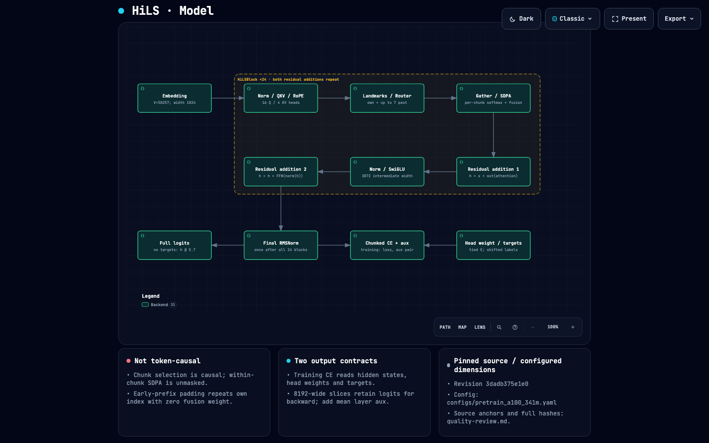

# HiLS-Attention-Lite

A from-scratch PyTorch implementation of **HiLS learned sparse chunk
attention** (Tencent, arXiv:2607.02980): a ~341M-param GQA transformer whose
attention selects *which* chunks each query chunk reads — via landmark
scoring and causal top-k — and is **trained end-to-end by the LM loss**
through score-fused attention. The portfolio's first learnable (natively
trained) sparse-attention model.

> **Status (2026-09-02):** Phases 0–4.2 complete — HiLS core (chunking,
> landmarks, router), hierarchical attention, sparse decode, two-phase
> pretrain loop, A100 boundary scripts. Phase 5 landed: the evaluation
> harness (`inference/evaluate.py`), the three headline eval scripts, and
> the docs (this README, [`HILS.md`](HILS.md), [`docs/`](docs/README.md)).
> Remaining: the A100 pod work — pretrain (~40–48 h) and the headline eval
> runs (B1–B4). Deep-dive: [`HILS.md`](HILS.md) · concepts:
> [`docs/concepts/`](docs/concepts/) · runbook: [`docs/guides/a100-runbook.md`](docs/guides/a100-runbook.md).

## Headline numbers — targets until the A100 runs say otherwise

| gate | measures | target | measured |
|---|---|---|---|
| B1 | decode throughput @ 16K vs LLaMA-3-Lite | ≥ 1.8× (claim ~2×) | *DISCLOSED — pending pod run* |
| B2 | effective KV-access fraction @ 16K | ≤ 0.08 (claim ~6%) | *DISCLOSED — pending pod run* |
| B3 | NIAH retrieval @ 64K (4× extrapolation, no stretching) | ≥ 85% | *DISCLOSED — pending pod run* |
| B4 | held-out ΔNLL @ 4096 vs LLaMA-3-Lite | ≤ +5% | *DISCLOSED — pending pod run* |

What is verified today, on CPU (68 tests, `python3 -m pytest -m "not gpu and
not slow"`): sparse ≡ eager attention (fp64, atol 1e-5, incl. k=N),
decode ≡ teacher-forced (fp64), causal top-k exact semantics, router
gradient flow (native trainability), chunked-CE ≡ eager CE, checkpoint
resume bit-equality, two-phase config, NaN-guard rollback, and the
evaluator protocol. The KV-access *counter* is exact by test (k·C keys +
N landmarks per layer-step); the ≤0.08 claim is a 16K-context property.

## Quickstart

```bash
python3 -m pytest -m "not gpu and not slow"   # the CPU gate — must pass before any change
python data/prepare_data.py                   # shared_data shards → data/pretrain_chinchilla/
bash scripts/launch_a100.sh                   # pretrain (A100 pod, auto-resume)
```

Evaluate (all scripts print `[PASS …]`/`[DISCLOSED …]` markers — never a
bare claim):

```bash
python scripts/longctx_eval.py --tiny --ctx 512 1024     # CPU self-check
python scripts/retrieval_eval.py --tiny                  # CPU self-check
python scripts/loss_parity_eval.py --tiny                # plumbing check
# A100 headline forms in docs/guides/quickstart.md §5
```

Docs: [`HILS.md`](HILS.md) is the deep-dive; [`docs/README.md`](docs/README.md)
indexes concepts / guides / references (every `file.py:Symbol` anchor is
gate-checked by `scripts/check_docs.py`, and the HTML portal builds via
`python scripts/build_docs_html.py`).

---

## 🗺️ Visual Architecture Atlas

> Explore the full **[Interactive Visual Systems Guide](docs/hils_visual_guide.html)**: three verified Archify showcase maps, live routing experiment, learning-rate schedule explorer, and [verification receipts](docs/hils_receipts.json).

<div align="center">
  <a href="docs/hils_visual_guide.html">
    
  </a>
  <p><em>Figure 1: HiLS-Attention-Lite Architecture Map — ~341M GQA transformer with landmark-guided chunk routing, causal top-k selection, and score-fused attention. Click image to open interactive guide.</em></p>
</div>

### Interactive Architecture & Systems Diagrams

| Diagram | Description | Interactive HTML | Visual Preview |
|---|---|:---:|:---:|
| **HiLS Architecture** | 24-layer GQA transformer, learned landmark projections, chunking mechanism ($C=128$), causal top-k routing, and score fusion | [Open Map ↗](docs/hils_architecture.html) | [PNG](docs/hils_architecture.visual-check.1440x900.dark.png) |
| **Data Pipeline** | 8.0B-token universal pipeline, GPT-2 BPE tokenizer, binary chunk sharding, and memory-mapped `PretrainDataset` | [Open Map ↗](docs/hils_dataflow.html) | [PNG](docs/hils_dataflow.visual-check.1440x900.dark.png) |
| **Pretraining Workflow** | Two-phase pretraining (Phase 1: 7B @ 4096 ctx; Phase 2: 1B @ 16K ctx), AdamW schedule, and checkpoint validation | [Open Map ↗](docs/hils_workflow.html) | [PNG](docs/hils_workflow.visual-check.1440x900.dark.png) |

---

## Verification at a glance

| test class | pins |
|---|---|
| `test_hils_matches_eager_reference` | sparse gather path ≡ O(T²) per-chunk reference (fp64) |
| `test_sparse_decode_matches_teacher_forced` | cached decode ≡ teacher-forced, every layer |
| `test_retrieval_score_gradient_flow` | LM loss reaches W_ℓ + q̄ (native trainability) |
| `test_router.py` | causal top-k semantics, own-chunk-always, fusion, balance |
| `test_loss.py` / `test_training.py` | chunked-CE ≡ eager CE; resume, guards, phase switch |
| `test_doc_refs.py` | every doc anchor resolves; every public symbol cited |

Design lineage: the workspace design doc `DESIGN-hils-attention-lite.md`
(§12 lists the documented Lite decisions vs upstream); house conventions from
DiffusionGemma-Lite; baseline
[LLaMA-3-Lite](https://github.com/atandra2000/LLaMA-3-Lite) (515M GQA —
budget delta disclosed in every comparison).